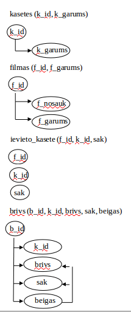
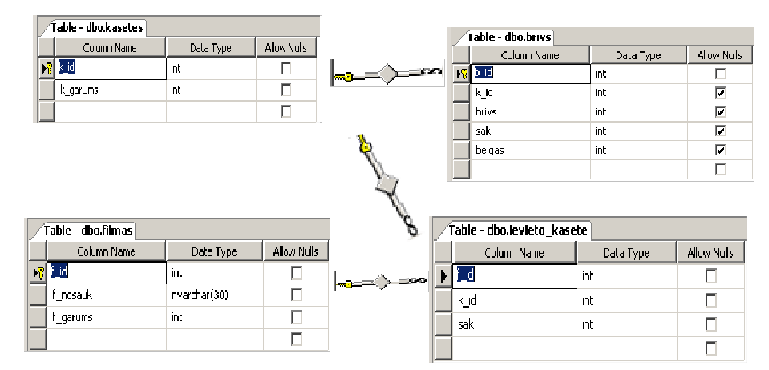

# Videotēkas optimizēšana

Praktiskais darbs "Datu bāzes I" 1. kursa students Jānis Rullis jr07023.
Rīga, 2009

## Uzdevuma nostādne

Ir ziņas par videokasetēm, par filmām. Vajag sniegt izziņas par brīvām vietām
kasetēs, par filmas esamību vairākās  kasetēs, kasetē esošajām filmām, par 
iespēju ierakstīt filmu kādā kasetē. Šo izziņu sniegšanai vajag izveidot 
atbilstošus SELECT pieprasījumus. Vajag mainīt informāciju. 

## Datu bāzes apraksts

Videotēkā ir ziņas par kasetēm un  filmām. Kasetēs ir norādīti brīvie posmi, kur
 var ierakstīt filmu. Lai ierakstītu filmu kasetē, jānorāda: kasetes ID, filmas ID,
 un vietu (f_sak) no kuras sāksies filma.

Datu bāze realizēta ar MS SQL Server 2005.

## Funkcionālo atkarību grafi.



## Fiziskais ER modelis



## Normālformas

Tabula 'ievieto_kasete' nav 1.NF, jo tai nav piešķirts PK. Neizmantoju atslēgu,
 jo šīs tabulas saturam nav jābūt unikālam, tas nav jāatrod un uz šo tabulu 
nenorāda neviena ārējā atslēga. Tabula 'brīvs' nav 3.NF, jo kolonnas 'brivs','sak',
beigas' ir savstarpēji saistītas un nav nodalītas atsevišķā tabulā. Pārāk vēlu to
 pamanīju, un nepaspēju izmainīt. Pārējās tabulas atbilst 3.NF : to lauki 
neatkārtojas un ir piesaistīti pie PK.

## SQL skripti

### Datubāzes veidošanas skripti

```
create database filmas
go
use filmas
```

### Tabulu veidošanas un informācijas ievietošanas skripti

#### kasetes

```
-- ------------------------------------------------------------
-- glaba info.par kasetēm
-- ------------------------------------------------------------

create table filmas.dbo.kasetes
(
  k_id int identity(1,1) primary key,
  k_garums int check(k_garums>0) not null 
)

insert filmas.dbo.kasetes values (3600)
insert filmas.dbo.kasetes values (1800)
insert filmas.dbo.kasetes values (900)
insert filmas.dbo.kasetes values (1800)
insert filmas.dbo.kasetes values (7200)
insert filmas.dbo.kasetes values (7200)
```

#### filmas

```
-- ------------------------------------------------------------
-- glabā info.par filmām
-- ------------------------------------------------------------
create table filmas.dbo.filmas
(
  f_id int identity (10000,1) primary key,
  f_nosauk nvarchar(30) not null,
  f_garums int check(f_garums>0)  not null
)

insert filmas.dbo.filmas values ('A',3600)
insert filmas.dbo.filmas values ('B',3600)
insert filmas.dbo.filmas values ('C',7200)
insert filmas.dbo.filmas values ('D',1700)
insert filmas.dbo.filmas values ('E',600)
insert filmas.dbo.filmas values ('F',1000)
```

#### ievieto_kasete

```
-- ------------------------------------------------------------
-- glabā info.par filmām kasetēs
-- ------------------------------------------------------------
create table filmas.dbo.ievieto_kasete
(
  f_id int foreign key references filmas.dbo.filmas not null,
  k_id int foreign key references filmas.dbo.kasetes not null,
  f_sak int check(sak>=0)not null
)

insert filmas.dbo.ievieto_kasete values (10000,6,0)
insert filmas.dbo.ievieto_kasete values (10001,1,0)
insert filmas.dbo.ievieto_kasete values (10002,5,0)
insert filmas.dbo.ievieto_kasete values (10003,2,0)
insert filmas.dbo.ievieto_kasete values (10004,3,300)
insert filmas.dbo.ievieto_kasete values (10004,6,4600)
insert filmas.dbo.ievieto_kasete values (10005,4,200)
insert filmas.dbo.ievieto_kasete values (10005,6,6200)
```

#### brivs

```
-- ------------------------------------------------------------
-- glabā info.par brīvajām vietām kasetē
-- ------------------------------------------------------------
create table filmas.dbo.brivs
(
  b_id int identity(20000,1) primary key,
  k_id int foreign key references kasetes,
  brivs int check(brivs>=0),
  sak int  check(sak>=0) default (0),
  beigas int
)

insert filmas.dbo.brivs values (1,0,null,null)
insert filmas.dbo.brivs values (2,100,1700,1800)
insert filmas.dbo.brivs values (3,300,0,300)
insert filmas.dbo.brivs values (4,200,0,200)
insert filmas.dbo.brivs values (5,0,null,null)
insert filmas.dbo.brivs values (6,2600,3600,6200)
```

### Tabulu dzēšanas skripts

```
drop table ievieto_kasete
drop table filmas
drop table brivs
drop table kasetes
```

### Informācijas labošanas pieprasījumi

```
	update filmas set f_nosauk='Krekli' where f_nosauk='A'
	update kasetes set k_garums='7200' where k_id=3
```

### Informācijas dzēšanas pieprasījumi

```
	delete filmas where f_id=10001
	delete brivs where b_id=20000
```

### Informācijas atlasīšanas pieprasījumi

```
-- ---------------------------------------------------------------
Informācija par kasetēs ievietotajām filmām
-- ---------------------------------------------------------------
select * from filmasUnKasetes

-- ---------------------------------------------------------------
Informācija par brīvajām vietām kasetēs
-- ---------------------------------------------------------------
select * from brivas_vietas

-- ----------------------------------------------------------------
Informācija par filmas esamību vairākās kasetēs
-- ----------------------------------------------------------------
select * from filmasUnKasetes
where f_id='filmas_id'

-- -----------------------------------------------------------------
--Informācija par iespēju ierakstīt filmu kādā kasetē
-- -----------------------------------------------------------------
select * from brivas_vietas
where brivs>='filmas garums'
viecot filmas ievietošanu, parādās vai tas ir iespējams
```

### Skatu izveidošana

```
-----------------------------------------------------------------------
-- skats, kas parāda brīvās vietas kasetēs
-----------------------------------------------
go
create view brivas_vietas
as
select * from brivs
 -----------------------------------------------------------------------
-- skats, kas parāda kasetēs ievietotās filmas
----------------------------------------------
go
create view filmasUnKasetes
as
select ik.k_id, k.k_garums, ik.f_id,
f.f_nosauk, f.f_garums, ik.sak, (ik.sak+f.f_garums) as beigas
from filmas.dbo.ievieto_kasete ik inner join filmas.dbo.kasetes k
on ik.k_id=k.k_id
inner join  filmas.dbo.filmas f
on ik.f_id=f.f_id
```

### Skata dzēšana

```
drop view filmasUnKasetes
drop view brivas_vietas
```

### Trigeris

```
------------------------------------------------------------------------------------------------------------------------------
-- trigeris, kas reaģē uz filmas ievietošanu kasetē.
-- Pārbauda un ja dati ir pareizi, veic izmaiņas tabulās ievieto_kasete
-- un brivs
-----------------------------------------------------------------------------
go
create trigger insert_film_in_kas
on ievieto_kasete
instead of insert
as
declare @ibeigas int , @bk_id int , @bbrivs int , 
@bsak int , @bbeigas int, @b_id int

if exists(select * from filmas.dbo.filmas as f inner join inserted as i
on(f.f_id=i.f_id) where f.f_id=i.f_id) 
print 'pareizi ievadits f_id'
else print 'NEpareizi ievadits f_id'

select @ibeigas=(i.sak+f.f_garums) from filmas as f
inner join inserted as i
on(i.f_id=f.f_id) where f.f_id=i.f_id

if exists(select * from brivs as b inner join inserted as i
on(b.k_id=i.k_id)  inner join filmas as f 
on(f.f_id=i.f_id) where b.brivs>=f.f_garums)
 print 'sada kasete ir pieejama'
else print 'sada kasete nav pieejama'

if exists(select * from brivs as b inner join inserted as i
on(b.k_id=i.k_id)
where @ibeigas<=b.beigas and i.sak>=b.sak) 
  begin
    print 'pareizi ievadits posms'

	select @bk_id=i.k_id, @bbrivs=b.brivs, @bsak=b.sak, @bbeigas=b.beigas,
	@b_id=b.b_id
 	from brivs as b inner join inserted as i 
	on (b.k_id=i.k_id) where b.k_id=i.k_id and b.sak<=i.sak and b.beigas>=@ibeigas
	--beidzot notiek insert
	insert ievieto_kasete select f_id,k_id,sak from inserted
	if exists (select * from inserted as i where i.sak=@bsak ) 
	 begin
	 print 'a'
		if (@ibeigas<@bbeigas)
			 begin
				print 'a1'
				print @b_id
				update brivs set sak=@ibeigas, brivs=@bbeigas-@bsak
				where b_id=@b_id
			 end
		if (@ibeigas=@bbeigas)
			begin	
				print 'a2'
				delete filmas.dbo.brivs where b_id=@b_id
			end
          end
   else
   begin	
   print 'b'
		if (@ibeigas<@bbeigas)
			begin
				print 'b1'
				update brivs set beigas=i.sak,brivs=i.sak-@bsak from inserted as i
				where b_id=@b_id

				insert brivs select i.k_id,@bbeigas-@ibeigas,@ibeigas,@bbeigas from inserted as i
			end
		else
			begin
				print 'b2'
				update filmas.dbo.brivs set beigas=i.sak
				from inserted as i
				where b_id=@b_id
			end
	  end
   --select * from filmasUnKasetes
   --order by f_id
 end
else 
begin
print 'NEpareizi ievadits posms'
rollback
end
----------------------------------------------------------------------------------------
--Trigeris, kas reaģē uz jaunas kasetes ievietošanu. Veic izmaiņas tabulās kasetes un brīvs
---------------------------------------------------------------------------------------
go
create trigger ievieto_kaseti
on kasetes
instead of insert
as
begin
declare @c int
insert kasetes (k_garums) select k_garums from inserted
select @c=@@IDENTITY from kasetes
insert brivs (k_id,brivs,sak,beigas) select @c, i.k_garums as brivs,0,i.k_garums as beigas from inserted as i
end
```