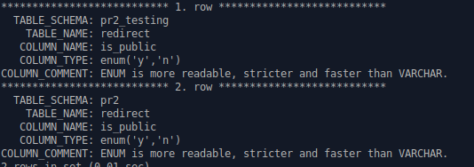

# Search-schema-docs-and-comments

* https://dev.mysql.com/doc/refman/8.0/en/mysql-commands.html

## Example - get information about public fields
> Append `\G;` to see the whole text in CLI.

```sql
SELECT TABLE_SCHEMA, TABLE_NAME, COLUMN_NAME,COLUMN_TYPE, COLUMN_COMMENT FROM information_schema.`COLUMNS` 
WHERE `COLUMN_COMMENT` LIKE '%public%'
OR COLUMN_NAME LIKE '%public%';
```



## Search tables

```sql
select table_name
from information_schema.tables
where table_type = 'BASE TABLE'
and table_name LIKE 'user_log_%'
and table_schema = 'my_db';
```

## Functions

```sql
SELECT 
    routine_name
FROM
    information_schema.routines
WHERE
    routine_type = 'FUNCTION'
        AND routine_schema = 'my_db';
```
