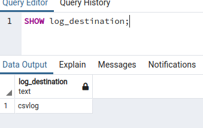

# Log

* https://www.endpoint.com/blog/2014/11/12/dear-postgresql-where-are-my-logs
* https://tableplus.com/blog/2018/10/how-to-show-queries-log-in-postgresql.html#:~:text=The%20location%20of%20the%20log,pgsql%2Fdata%2Fpg_log%2F%20.

## [Edit conf](https://github.com/Janis-Rullis-IT/sql/edit/master/postgresql/Conf.md)


## See variables

```sql
SHOW log_destination;
```
> stderr

### After changes



```sql
show log_directory ;
```
> log

```sql
show log_filename ;
```

> postgresql-%Y-%m-%d_%H%M%S.log
