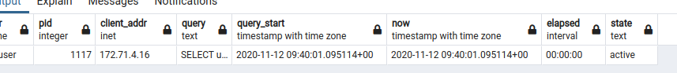

# Processes

* https://gist.github.com/romuald/f73aa7af4d32a4fe8866ca377d623d13
* https://medium.com/little-programming-joys/finding-and-killing-long-running-queries-on-postgres-7c4f0449e86d

```sql
SELECT user, pid, client_addr, query, query_start, NOW() as now, NOW() - query_start AS elapsed, state
FROM pg_stat_activity
WHERE state != 'idle'
ORDER BY elapsed DESC;
```



```sql
SELECT pg_terminate_backend(__pid__);
SELECT pg_cancel_backend(__pid__);
```

## PGAdmin/Statistics or Dashboard
