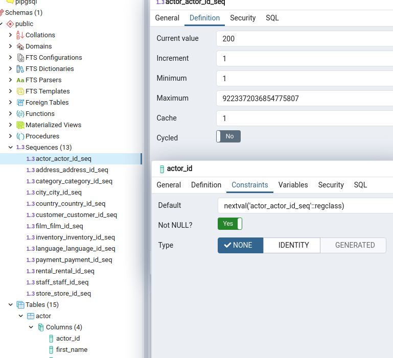

# [Seq](https://www.postgresql.org/docs/9.5/sql-createsequence.html)




```sql
CREATE SEQUENCE serial START 101;
```

## [Functions](https://www.postgresql.org/docs/9.1/functions-sequence.html)

```sql
SELECT nextval('serial');
```
> 101

```sql
SELECT currval('serial');
```
> 101

```sql
SELECT lastval();
```
> 101

## Set

```sql
SELECT setval('serial', 200); 
```
> 200

```sql
SELECT nextval('serial');
```
> 201

```sql
SELECT currval('serial');
```
> 201
