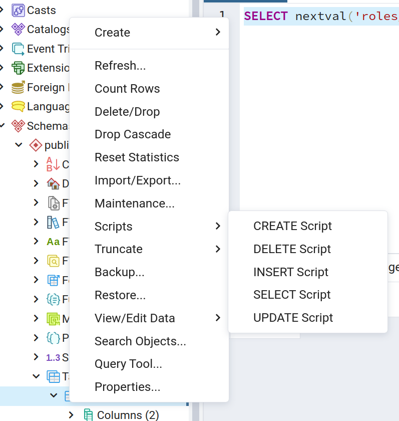
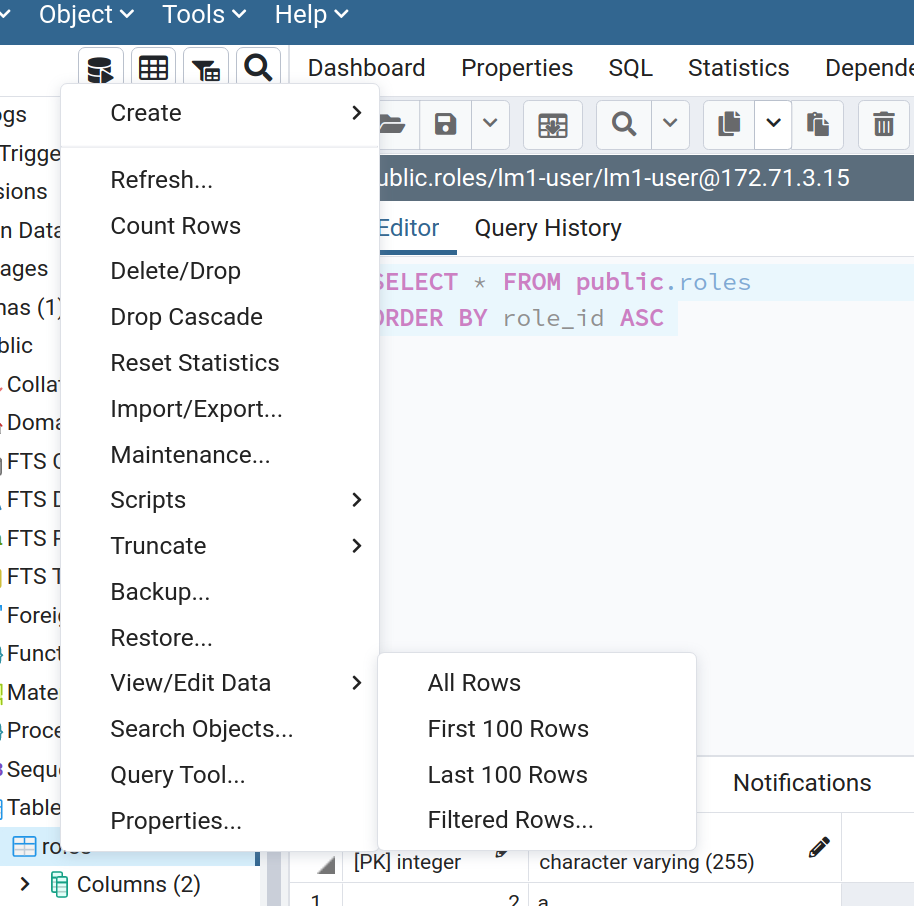
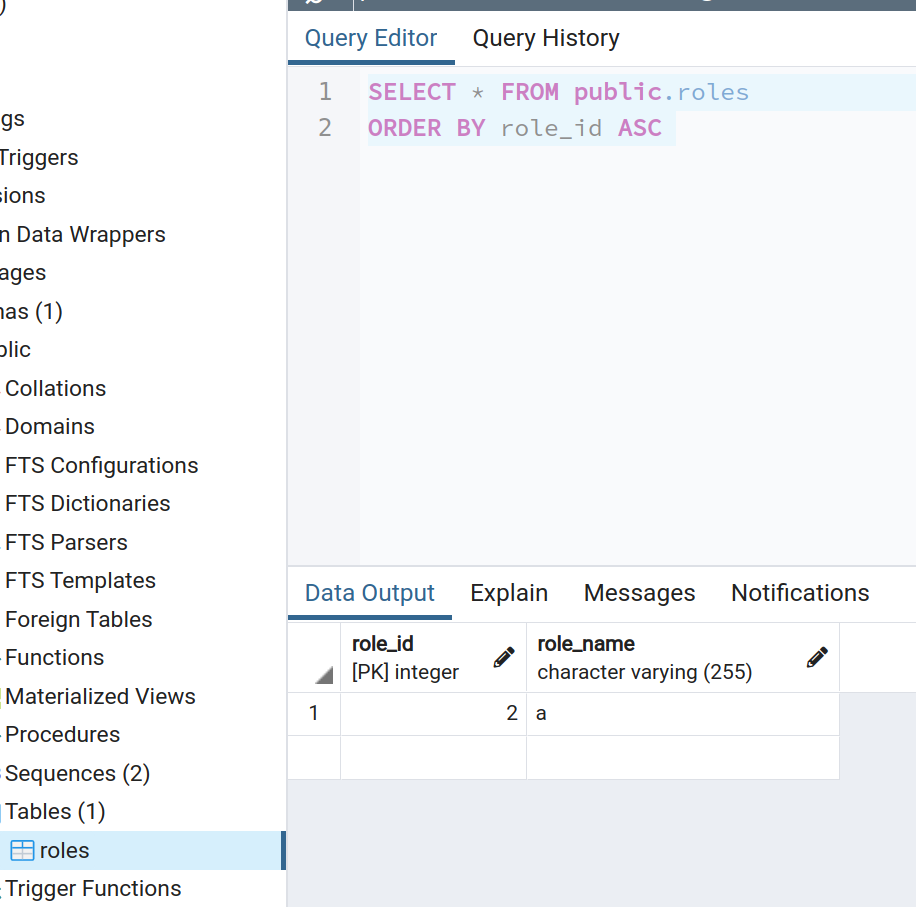

# pgadmin

## Test drive

https://www.pgadmin.org/try/

## Insert



```sql
INSERT INTO public.roles(role_name)	VALUES ('a');
```

## View



```sql
SELECT * FROM public.roles
ORDER BY role_id ASC;
```


